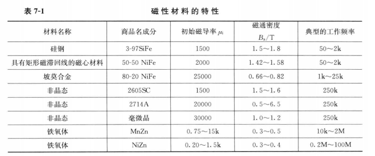
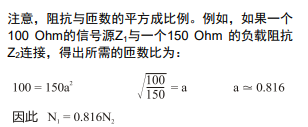

# Hydroacoustic board : Transformer Design

---

## Overview

本文档主要用于记录学习变压器制作过程中的学习笔记。作为后续设计变压器的理论参考以及记录变压器的设计流程。

---

## 1. 变压器设计理论基础

---

### 1.1 磁学基础

- **磁导率** $\mu$ ：磁通密度$B$与磁场强度$H$的比值。
 
- **磁心**：有较高的磁导率，并且可以限制磁通路径。磁心随着$H$强度的增加，会产生饱和现象，使$\frac{B}{H}=1$，几乎表现和空心一样。
 
- **磁滞回线**：表征磁心中的能量损失，最好用直流电流，使$H$慢慢增强，避免在材料中产生涡流。$B-H$回线内部面积是磁心材料一个周期中能量损失的量度。
 
- **磁动势**$mmf$：$mmf=0.4 \pi N I$。其中$N$是线圈的匝数，$I$是电流，$H$是磁场强度，$mmf$是磁动势。
 
- **磁场强度**H：$H=\frac{mmf}{MPL}$。其中$MPL$为磁路长度（cm）。
 
- **磁通密度**$B$：$B=\frac{\phi}{A_{c}}$。其中$\phi$为磁通，$A_{c}$为磁心面积，$B$物理意义为每单位面积内的磁力线根数。
  
- **磁化电流峰值**$I_{m}$：$I_{m}$=$\frac{H_{o}(MPL)}{0.4\pi N}$。其中$H_{o}$为工作点峰值处的磁场强度。
 
- **磁阻**$R_{m}$：由磁动势$mmf$在材料中产生磁通$\phi$取决于材料对$\phi$的阻力，称为磁阻。取决于材料类和物理尺寸。$mmf$=$\phi$*$R_{m}$。$R_{m}$=$\frac{MPL}{\mu_{r} \mu_{o} A_{c}}$。其中$\mu_{r}$为相对磁导率，$\mu_{o}$为空气的磁导率。

- **空气隙**：由于空气隙的磁阻率远大于磁性材料，所以通过空气隙来控制整个磁阻大小。总磁阻为磁心磁阻加上空气隙的磁阻。 计算公式同上。$R_{mt}=R_{m}+R_{g}=\frac{l_{t}}{\mu_{e}A_{c}}$ ,其中$\mu_{e}$为等效磁导率，$l_{t}$为总的磁路径长度。在磁动势一定时，可以用空气隙来控制磁通密度。

---

### 1.2 磁性材料及其特性

- **矫顽力**$H_{c}$：使$B$值变为$0$的反向磁场强度。

- **剩余磁通密度**$B_{r}$: 当磁场强度$H$为$0$时的磁通密度。

---

### 1.3 磁心  

- **磁心用途**：装盛磁通，创建一个可预计的磁通路径。

- **磁路长度**$MPL$：磁通所占据的这个磁通路径的平均路程。

- **磁心结构**：壳形：磁心包围线圈。心形：线圈包围磁心。 

- **涡流**：交流电压添加到一次绕组，在磁心中感应出交流磁通，交流磁通在二次绕组中产生感应电压，这个交流点电压也在磁心材料中产生电压进而产生电流，称为涡流。受材料电阻率的制约。有叠片间涡流和叠片内涡流两种。添加绝缘涂层来减少涡流。

- **应力**：变压器材料中的应力会导致磁化电流的变大。应力消除可以使用退火操作：将磁性材料加热到规定温度再冷却到室温。

- **叠片**：将空气隙和完整磁性材料片邻近排列，可以增加磁导率。

- **励磁电流**$I_{m}$：用于建立磁场的电流。有气隙的磁性材料，由于磁导率下降，电感$L$下降，容易使电流变大，也就是励磁电流$I_{m}$变大，更容易饱和。而环形磁心的$L$更大，从而励磁电流不会变得很大，从而相比下不容易饱和。

- 磁心设计参考见书籍内容。

---

### 1.4 窗口的利用、励磁导线和绝缘

1. **窗口利用系数**$K_{u}$:  
   变压器或者电感器的窗口面积中铜所占的比例。影响因素如下：
    
    - 导线的绝缘：$S_{1}$，
    - 层绕或乱绕的情况下，导线的填充系数：$S_{2}$。
    - 有效窗口面积：$S_{3}$。
    - 多层绕组或绕组间所需要的绝缘：$S_{4}$。
    - 加工技术水平

    $K_{u}=S_{1}S_{2}S_{3}S_{4}$。
    其中：$S_{1}=\frac{导体面积}{导线面积}$。$S_{2}$为绕线面积/可利用的窗口面积，方形绕制$S_{2}=0.785$，六边形绕制$S_{2}=0.907$，不过一般都是在$0.61$左右。$S_{3}$为可利用的窗口面积/窗口面积。$S_{4}$为可利用的窗口面积。一般$S_{1}=0.855,S_{2}=0.61,S_{3}=0.75,S_{4}=1,K_{u}=S_{1}S_{2}S_{3}S_{4}=0.4$。

    导体面积：$A_{w(B)}=铜面积$  
    导线面积：$铜面积+绝缘面积$  
    绕线面积：$匝数\times 导线长度$  
    可利用的窗口面积：$可得到的窗口面积-由所采用的绕制方法和技术所造成的空间面积$  
    窗口面积：可得到的窗口面积。  
    绝缘面积：为包绕绝缘所用去的面积。

2.  **趋肤效应**：
   
    在较高的工作频率下，电流会向导线表面附近集中，是由于磁链在励磁导线中产生的涡流引起的。趋肤效应会使等效的交流电阻与直流电阻的比值大于1，高频下需要进一步估算导线的尺寸。电流密度下降到导体表面电流密度的$\frac{1}{e}$处与导体表面的距离定义为趋肤深度$\epsilon=\frac{6.62}{\sqrt{f}}K(cm)$，其中$f$为工作频率，$K$为材料系数，对于$Cu$，$K$为1。本质原因是高频电流会感应处反向电场，在导线内部受到影响最严重，而电流总是选择阻力最小的路径，便到了表面。
    
    在选择导线时，最大导线直径为$2\epsilon$。

3. **邻近效应**：
   
   邻近处另外导体产生的交流磁场在本导线中感应出的涡流，进一步引起电流密度的畸变。一侧增强了电流，另一侧的电流就自然会减小一部分。

    要使邻近效应最小，需要设计具有最小绕组层数的变压器，选择具有窄长窗口的磁心，同时可以获得具有最小漏感的磁心。

    交错绕组可以减少邻近效应，铜损和发热。

4. **等效导体厚度$h$**：  
   $0.866D_{AWG}$。用于Dowell曲线模型。纵坐标为$R_{R}=\frac{R_{AC}}{R_{DC}}$，横坐标为$K=\frac{h\sqrt{F_{1}}}{\epsilon}$，其中$\epsilon$为趋肤深度，$F_{1}=\frac{ND_{AWG}}{l_{w}}$。

5. **矩形磁心（骨架）平均匝长$MLT$的计算**：  
   矩形部分沿用内部骨架，四个圆角近似为圆形。

6. **环形磁心的平均匝长$MLT$近似**：  
   $MLT=0.8(OD+2H_{t})$，其中$OD$为环形磁心外径，$H_{t}$为厚度。

7. **导线的直流电阻$R_{DC}$**:  
   $R_{DC}=\frac{\rho l}{A_{W}}$。其中$\rho$为电阻率，$A_{W}$为导线横截面积。

---

### 1.5 变压器设计折中

1. **一般性问题**：  
   输出功率$P_{o}$，工作电压乘以最大电流；最小运行效率，取决于最大功率损失。特定温度环境所允许的最大温升。磁心材料的体积和质量，成本。

2. **面积积$A_{p}$与功率处理能力**：  
   $A_{p}=W_{a}\times A_{c}$，$W_{a}$为窗口面积，$A_{c}$为磁心的横截面积。变压器虽然横截面积有两个截面，但是并不是两个独立通道，所以只取其中一个截面作为主磁通路径。   
   $A_{p}$ 与 $P_{t}$ 的关系为：$A_{p}=\frac {P_{t}\times 10^{4}}{K_{f} K_{u} B_{m} J f}  (cm^{4})$。  
   其中$K_{f}$为波形系数，对于方波，$K_{f}=4.0$；对正弦波，$K_{f}=4.44$。$B_{m}$为磁通密度，$J$为电流密度，$f$为工作频率，$K_{u}$为窗口利用系数。  

3. **$K_{g}$与变压器调整率和功率处理能力的关系**：  
   调整率$\alpha = \frac{P_{t}}{2K_{g}K_{e}}(\%)$。表示负载变化时输出电压的变化程度，比如空载到满载。  
   常数$K_{g}$由磁心的几何形状及尺寸决定：  
   $K_{g}=\frac{W_{a}A_{c}^{2}K_{u}}{MLT}(cm^{5})$  
   常数$K_{e}$由磁和电的工作状况来决定:  
   $K_{e}=0.145K_{f}^{2}f^{2}B_{m}^{2}\times 10^{-4}$  
   其中$K_{f}$为波形系数。

4. **变压器的体积和$A_{p}$的关系**：  
   $V=K_{vol}A_{p}^{0.75}$，其中$K_{vol}$为体积系数，取决于磁心的结构，参考表5-2。

5. **变压器的质量和$A_{p}$的关系**：  
   $W_{t}=K_{w}A_{p}^{0.75}$，其中$K_{w}$是与磁心结构相关的系数，参考表5-3。

6. **变压器的表面积和$A_{p}$的关系**：  
   $A_{t}=K_{s}A_{p}^{0.5}$,其中$K_{t}$是与磁心结构相关的系数,参考表5-4。

7. **变压器的电流密度$J$和$A_{p}$的关系**：  
   $J=K_{j}A_{p}^{-0.125}$,其中$K_{j}$与磁心结构有关,数值参考表5-5。

8. **变压器磁心的几何常数$K_{g}$和$A_{p}$的关系**：  
   $A_{p}=K_{p}K_{g}^{0.8}$,其中$K_{p}$与磁心结构相关,数值参考表5-6。

9. **质量与变压器调整率的关系**:  
    提高工作频率可以减少尺寸和质量.除此之外还可以调整变压器的调整率。

---

### 1.6 变压器-电感器的效率,调整率和温升。

1. **变压器的效率**:  
   总功率损失 $P_{\Sigma}=P_{Fe}+P_{Cu}$,分为磁心损失和铜损。

2. **最大效率**:  
   最大效率发生在$P_{Fe}=P_{Cu}$的情况。

3. **表面耗散的总热能**:  
   $W=5.70\times 10^{-12}\epsilon (T_{2}^{4}-T_{1}^{4})+1.4\times 10^{-3}F\theta^{1.25}\sqrt{P}$  
   其中,$\epsilon$为发射系数,$T_{1}$为环境温度$(K)$,$T_{2}$为发热物体的温度$(K)$,$F$为空气摩阻系数,$\theta$为温升,$P$为相对大气压。

4. **温升与表面热耗散的关系**:  
   参考图6-2。

5. **要求的表面积$A_{t}$**:  
   参考图6-4。

6. **电压调整率$\alpha$**:  
   $\alpha = \frac{V_{o}(N.L.)-V_{o}(F.L.)}{V_{o}(F.L.)}$,其中$V_{o}(N.L.)$为空载电压, $V_{o}(F.L.)$为满载电压。  
   调整率很大一部分受铜损的影响,近似$\alpha=\frac{P_{Cu}}{P_{o}}\times 100\%$。

---

### 1.7 伏秒平衡

1. **理论内容**：变压器的磁心需要输入的磁通全部输出，否则磁通会不断积累，有饱和风险。  
   由 $\Delta \Phi = \int \frac{v(t)}{N}dt = \frac{1}{N}\int v(t)dt$ 可知，磁通的变化量等于电压对时间的积分，称为伏秒积。如果是周期信号，磁通最后会变成0.

2. $\int$

---

## 2. 变压器设计

---

### 1. 接收端变压器设计

1. **设计要求**：  
   - 用于信号隔离，小功率，尽可能减少失真。
   - 匝数比约1:1或1:2。
   - 换能器输入的一次绕组端阻抗约$2k\Omega$，希望二次绕组接收端阻抗不小于$10k\Omega$。
   - 工作频率33kHz,120kHz。
   - 变压器体积尽可能小。
   - 使用小环形磁心。

2. **未定参数**：
   - 一次绕组输入电压幅值：
   - 工作带宽：

3. **设计方案**  
   
   -  **磁心**：选择高频铁氧体环形磁心  
      优点：环形漏磁小，耦合好，小信号传输友好，结构简单。铁氧体MnZn的工作频段在 10k~2M，相比其他材质的磁心更适合。  
        

   - **漆包线直径**：  
      参考趋肤深度$\epsilon=\frac{6.62}{\sqrt{f}}K(cm)$，这里使用$Cu$作为导线，$K=1$，最高频率为$120kHz$，则可计算出漆包线最大直径为 $0.019cm$。  

   - **匝数**：
      由$Z_{m}=2\pi f L_{m}$，可根据阻抗需求计算出所需的电感值，结合厂家给的千匝电感量$A_{L}$计算出匝数。
   
   - **匝比**：1:1，注意匝数比和阻抗也有关系。
       
   
   - **磁心结构**：  
    环形，无气隙。优点在于环形，耦合好，小信号传输友好，结构简单。

### 2. 输出端变压器设计

1. **设计要求**：  
   - 工作频率33kHz,120kHz。
   - 功率50W。
   - 使用开关电源或模拟电源,优先设计开关电源。
   - 加入气隙，注意避免饱和。
   - 注意温升，寄生电容，邻近效应，趋肤效应。
   - 加入额外串联电感。  
  
2. **设计方案**    
     
   - **磁心结构**：
     EI型，方便添加气隙，绕组。

   - **漆包线直径**：
      参考趋肤深度$\epsilon=\frac{6.62}{\sqrt{f}}K(cm)$，这里使用$Cu$作为导线，$K=1$，最高频率为$120kHz$，则可计算出漆包线最大直径为 $0.019cm$。  

   - **匝数**：
      由伏秒平衡,假设电压为$V$,导通时间为$t_{on}$,  
      则$\Delta \Phi=\frac{V\times t_{on}}{N}$。  
      则磁通密度$\Delta B = \frac{V \times t_{on}}{NA_{c}}$,  
      为了避免饱和,要求 $\Delta B < B_{max}$ ,                                                                                                                                                                             
      从而$N > \frac{V \times t_{on}}{B_{max} A_{c}}$。
      由$t_{on}=\frac{D}{f}$
      从而$N>\frac{V \times D}{B_{max} A_{c}f}$,其中$D$为占空比,$f$为最低频率,$B_{max}$为最大磁通,$A_{c}$为磁心的磁路有效面积。

   - **铜损**
      一次绕组和二次绕组分别测量出空载和满载的$P_{p}$和$P_{s}$，即可得出铜损$\alpha=\frac{P_{s}+P_{p}}{P_{o}}\times 100\%$

   - **电流密度**  
      $J=\frac{I}{A_{wire}}$，求出大概的电流密度，避免过热损坏变压器,可依此适度增大漆包线直径。

   - **励磁电感**
      由电感定义：$V=L\frac{dI}{dt}$，其中$L$为电感值，$I$为电流。  
      从而$L_{m}=\frac{V\Delta t_{on}}{\Delta I_{m}}$。 
      由$t_{on}=\frac{D}{f}$，则$L_{m}=\frac{V\times D}{\Delta I_{m}f}$。由此也可以得出，电压固定，频率一定时，控制电流大小的就是电感值 。
      一般$\Delta I_{m}$取满载电流的$10\%-30\%$  
      而满载电流$I_{avg}\times \eta = \frac{P_{o}}{V_{bus}}$，这里的 $\eta$ 为传输效率。

   - **气隙控制**
      使等效磁导率下降，使励磁电感可控，用已知厚度的绝缘胶带垫在磁心间或者把EI型磁心的中间打磨削去一部分。
   

   

