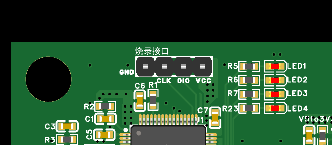
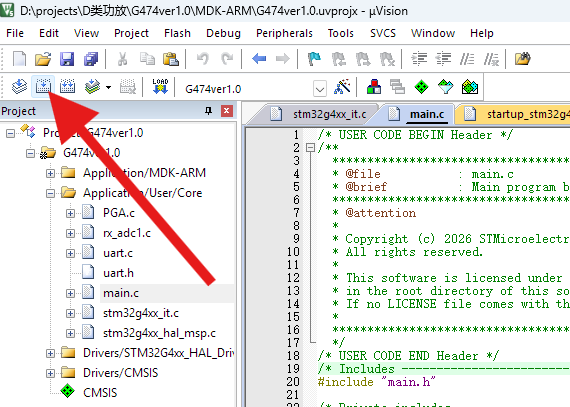
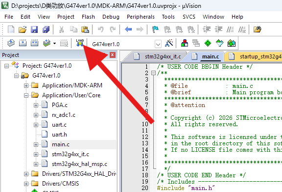
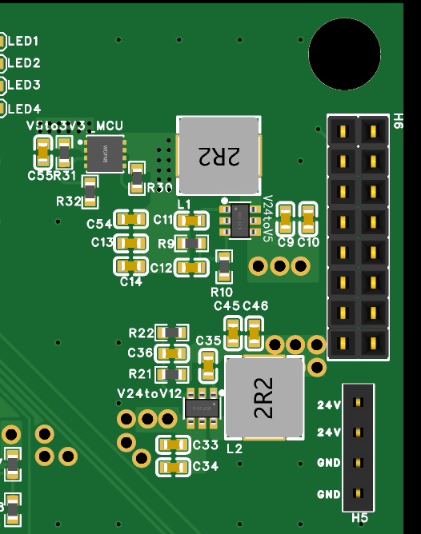
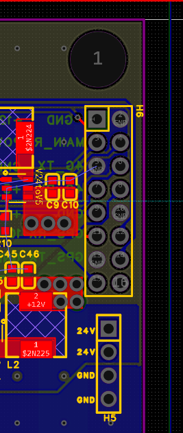
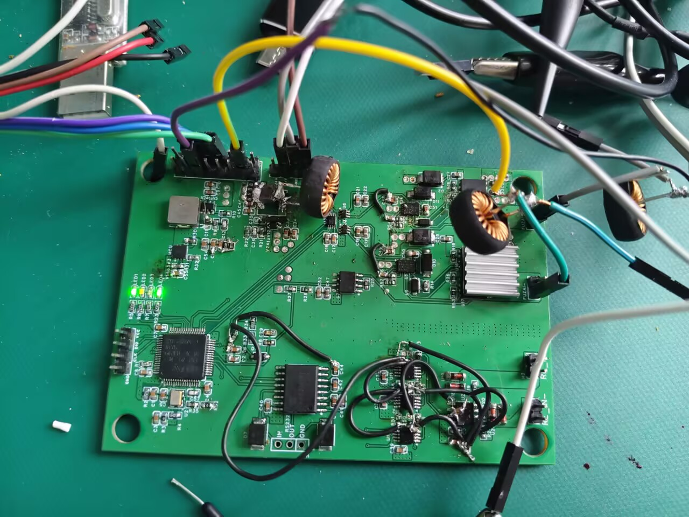
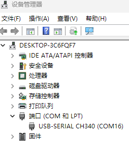
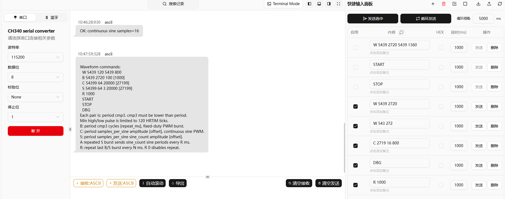

<style>
pre code {
  white-space: pre-wrap !important; /*防止不换行*/
  word-break: break-all !important; /*防止内容溢出*/
  overflow-wrap: anywhere !important; 
}

/* img {
  max-width: 50% !important;
  height: auto !important;
  display: block;
}

p img {
  max-width: 50% !important;
  height: auto !important;
} */

.markdown-preview img {
  max-width: 50% !important;
  height: auto !important;
}
</style>

# Overview

本文档主要用于记录水声板ver1.3的具体使用方法和使用事项。

---

## 1. 所需硬件设备及软件：
硬件：

- 水声板 ver1.3*1
- 上位机电脑*1
- USB to TTL 转换器*1
- STlink 仿真器*1
- 24V 可调数字直流电源*1
- LC低通滤波器*2
- 示波器*1

软件：

- STM32CubeMX
- Keil uVision5
- 串口调试助手

---

## 2. 使用步骤：

主要包括 1. 程序编写烧录，2. 发送模式使用，3. 指令集，4. 示例python脚本。

---

### 2.1 程序编写烧录：

**硬件连接**

- **1.！！！首先断开板上的24V电源输入！！！**
- 2.将 STlink 仿真器的 GND , VCC , SWD ,SWDIO 四个引脚用杜邦线连接到水声板的对应针脚，位于4颗LED灯左侧。
  

**软件操作**

- 1.打开 keil uVision5，选择水声板的项目文件。
- 
- 2.点击左上角的 **Build** 按钮构建程序。
  

- 3.点击 **load** 按键，将生成的二进制文件烧录进水声板。
  

- 4.等待下方输出窗口提示烧录成功，没有任何报错即可。

---

### 2.2 发送模式使用：

**硬件连接**

- 1.将 `24V` 电源连接到板子的电源输入位置，位于下图的右下角，四个并列的杜邦线针脚。初始最大电流可以限制在 `0.5A` 左右。后续根据负载需求，逐步往上增加电流，防止电流过高，损坏开发板。
  

- 2.在扩展排针处，将 USB to TTL 转换器的 USB 口连接上位机电脑， `TX` 连接 `6`号针脚 , `RX` 连接 `8` 号针脚 , `GND` 连接 `10` 号针脚。具体编号位置参考下图，或开发板后侧的 `4G_TX` ，`4G_RX` , `GND` 丝印标识。
  

- 3.将两个 `LC` 低通滤波器的电感串联引脚分别连接到 `FUZAI+` 和 `FUZAI-` 针脚，如图所示位置。另一个连接电容的杜邦线母座用于连接 `GND`，可以根据板子后侧的丝印标识，任意选择两个 `GND` 引脚进行连接。而杜邦线公头则是 `LC` 低通滤波器的输出端，可以分别连接到示波器的 `CH1` 和 `CH2` 用于观察，以及连接换能器负载。
  

  


**软件操作**

- 1.Windows 11系统下，右键任务栏的 `开始` 图标，打开设备管理器，找到串口转换器的端口号，如下图的 `COM16` .
  
- 2.Linux 系统下，可以通过 `ls /dev/ttyUSB*` 命令查看可用的串口设备，例如 `ttyUSB0` 或 `ttyUSB1` 等。如果无法确定是哪个设备，可以拔出转换器和插上转换器分别运行一次命令，看多了哪个设备。
- 3.打开串口调试助手，设置波特率为 `115200` , 数据位为 `8` , 停止位为 `1` , 校验位为 `None` , 然后连接到上位机电脑的串口。
  
- 4.在开发板启动初始阶段，会自动向串口发送调试用的命令，如上图所示，可以用来调试参考。
- 5.通过串口助手手动发送命令进行调试，或编写 python 脚本，自动向串口发送指令进行测试。

### 2.3 指令集：

在上电启动阶段，水声板会自动发送示例指令如下：
```text
Waveform commands:
  W 5439 120 5439 800
  B 5439 2720 100 [1000]
  C 54399 64 20000 [27199]
  S 54399 64 3 20000 [27199]
  R 1000
  START
  STOP
  DBG
Each pair is: period cmp3. cmp3 must be lower than period.
Min high/low pulse is limited to 120 HRTIM ticks.
B: period cmp3 cycles [repeat_ms], fixed-duty PWM burst.
C: period samples_per_sine amplitude [offset], continuous sine PWM.
S: period samples_per_sine sine_count amplitude [offset].
A repeated S burst sends sine_count sine periods every R ms.
R: repeat last B/S burst every N ms. R 0 disables repeat.
```

1. `W 5439 120 5439 800` 或 `W 5439 120` :
  - `W` 表示连续方波发送模式；
  - `5439` 是 `period`，用于设置发送信号的频率，计算公式为：$freq = \frac{5 440 000 000}{period + 1}$。原理是：单片机的高精度时钟 `HRTIM` 工作频率为 `5.44GHz`，`period` 往寄存器中修改比较器的参数，从 `0` 计数到 `5439` 作为一个周期，也就是 `5440` 个时钟周期，则 `1s` 内的周期数为 $freq = \frac{5 440 000 000}{period + 1}$，也就是 `1s` 内发出的方波个数，即 `freq = 1MHz`。
  - `120` 及 `800` ，是比较器寄存器  `cmp3` 的参数，用于设置方波的占空比，公式为：$duty = \frac{cmp3-cmp1}{period + 1}$，其中 `cmp1 = 0` 是另一个比较器的参数，用于设置方波上升沿或下降沿起始点，可以在 `STM32CubeMX` 中更改。例如：`cmp3 = 120`，则占空比为 `120 / (5439 + 1) = 0.0224`，即 `2.24%`。
  - `W 5439 120` 表示连续发送单一周期和占空比的方波。`W 5439 120 5439 800` 表示连续发送同一周期，不同占空比的方波。除去 `W` 的工作模式指令，后续的指令为 `period cmp3` 的组合形式，可以根据需求发送不同周期，不同占空比的方波。这是后续所有信号的基础。
  - **注意：最小高电平脉冲时间为120 HRTIM ticks , 也就是 `cmp3` 的最小值为120。小于该数值的话，信号的频率会失真不可控。**

2. `B 5439 2720 100 [1000]` :
  - `B` 表示猝发方波模式；
  - `5439` 是 `period`，用于设置发送信号的频率，使用方法同上。
  - `2720` 是 `cmp3`，用于设置猝发方波的占空比，使用方法同上。
  - `100` 是 `cycles` ，用于设置猝发方波的重复次数。
  - `[1000]` 是 `repeat_ms`，用于设置猝发方波的重复间隔时间，单位为毫秒。例如：`[1000]` 表示每1000毫秒重复一次，即每秒重复一次。也可以不带这个参数，表示只发送一次，后续再使用 `R` 指令来单独间隔时间。

3. `C 54399 64 20000 [27199]` :
  - `C` 表示连续正弦波模式；
  - `54399` 是 `period`，用于设置用于组成不同占空比正弦波的单个方波频率，使用方法同上。
  - `64` 是 `samples_per_sine`，也就是正弦波的采样点数，用于设置正弦波的精度，和 `period` 共同决定正弦波的频率 $freq = \frac{5.44G}{(period + 1)\times samples\_per\_sine}$。
  - `20000` 是 `amplitude`，用于设置正弦波的幅度，但由于后续加上了 `LC`低通滤波器，实际输出的幅度会改变很多，一般可以从 `period * 0.35` 开始测试，根据示波器的实际输出值进行调整，使最后输出在 `0-24V`。
  - `[27199]` 是 `offset`，用于设置正弦波的偏移量，一般可以设置为 `0`，也可以不填，或根据实际需求进行调整。

4. `S 54399 64 3 20000 [27199]` :
  - `S` 表示猝发正弦波模式；
  - `54399` 是 `period`，用于设置用于组成不同占空比正弦波的单个方波频率，使用方法同上。
  - `64` 是 `samples_per_sine`，也就是正弦波的采样点数，用于设置正弦波的精度，使用方法同上。
  - `3` 是 `sine_count`，用于设置正弦波的重复次数。
  - `20000` 是 `amplitude`，用于设置正弦波的幅度，使用方法同上。
  - `[27199]` 是 `offset`，用于设置正弦波的偏移量，使用方法同上。

5. `R 1000` :
  - `R` 表示重复上一次发送的信号，单位为毫秒。主要是针对猝发方波模式和猝发正弦波模式的重复发送，设置重复间隔时间。`R 0` 表示取消重复发送，只发送一次。

6. `START` :
  - `START` 表示启动发送模式，配合 `STOP` 命令使用。

7. `STOP` :
  - `STOP` 表示停止发送模式，配合 `START` 命令使用。

8. `DBG` :
  - `DBG` 表示调试模式，会给出当前寄存器的值，用于调试和查看寄存器状态。
```
DBG MCR=00080000 OENR=00000030 ODISR=00000000 TX_EN=1 PWM_EN=1 REP=0 STOP=0 TO=0
DBG tick=2861386 next=803743 stop_tick=802768 repeat_ms=1000 len=4
DBG TIMC CR=00000008 DIER=00100000 PER=5439 CMP1=1 CMP3=2720
DBG OUT=00020000 SET1=00000004 RST1=00000020 SET2=00000004 RST2=00000020
DBG GPIOB MODER=FAAFEE7F AFRH=00DD7700 PB12_AF=13 PB13_AF=13
```
 - 主要看一下 `cmp3`，`period`，的值就行。

### 2.4 示例python脚本：

```python
import time
import serial

PORT = "COM16"
BAUD = 115200
DWELL_S = 2

commands = [
    ("125k", "C 2719 16 800"),
    ("110k", "C 2719 18 900"),
    ("100k", "C 2719 20 1000"),
    ("90k",  "C 2719 22 1050"),
    ("80k",  "C 2719 25 1100"),
    ("70k",  "C 2719 28 1100"),
    ("60k",  "C 2719 33 1100"),
    ("50k",  "C 2719 40 1150"),
    ("40k",  "C 2719 50 1150"),
    ("30k",  "C 5439 33 2500"),
    ("20k",  "C 5439 50 2500"),
    ("10k",  "C 5439 100 2599"),
]

with serial.Serial(PORT, BAUD, timeout=0.2) as ser:
    time.sleep(0.5)
    ser.reset_input_buffer()

    while True:
        for label, cmd in commands:
            print(label, cmd)
            ser.write((cmd + "\n").encode("ascii"))
            time.sleep(DWELL_S)
```

这是个示例的扫频程序，每隔 `2s` 发送一次不同频率的正弦波，对应频率的指令如上所示，可以在此基础上修改。

## 3. 注意事项：

- 改变频率的时候，DMA有时候会没有响应，需要再发一次指令。