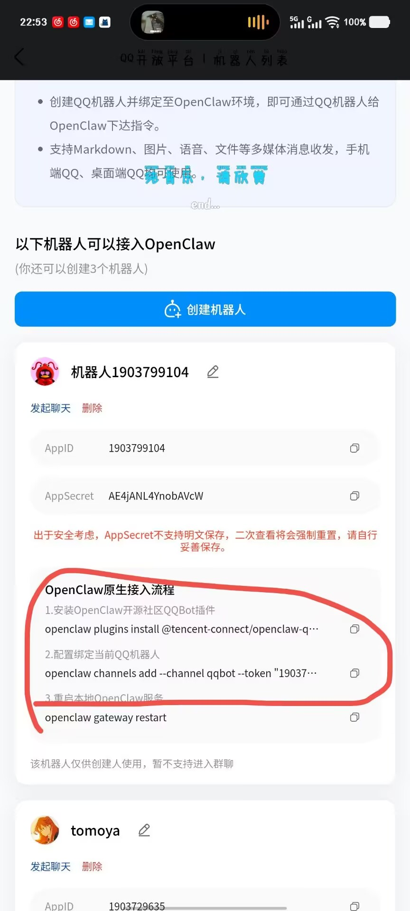
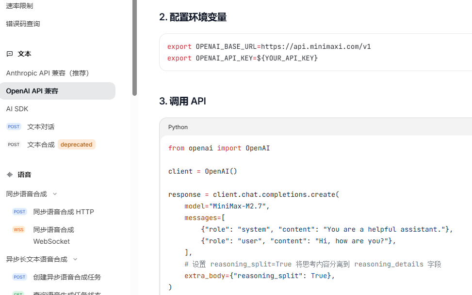

<style>
pre code {
  white-space: pre-wrap !important;
  word-break: break-all !important;
  overflow-wrap: anywhere !important;
}

img {
  max-width: 50% !important;
  height: auto !important;
  display: block;
}

p img {
  max-width: 50% !important;
  height: auto !important;
}

.markdown-preview img {
  max-width: 50% !important;
  height: auto !important;
}
</style>
# Openclaw Launch

---

## 1. Overview

This document outlines the steps to launch Openclaw and some bugs.

---

## 2. Steps

安装的具体操作流程：

### 2.1. 如果是 windows 系统，先安装 linux 子系统，然后安装 openclaw。

```bash
# 1. win+R 输入powershell,回车 
# 2. 安装 linux 子系统，一般选择安装 Ubuntu 22.04 版本，相对稳定。
wsl --install

# 3. 自行创建 username 和 password ,一般安装好后需要重启一下（也可能不用）
# 4. 在powershell中输入以下命令可以打开 linux 子系统
wsl

# 5. 切换到工作目录，一般刚启动是在User目录或者,/mnt/c ,也就是挂载的C盘目录。
mkdir ~/projects
cd ~/projects

```

### 2.2. 配置当前命令行的代理，不然git clone的速度跟乌龟一样。

```bash
# 1. 查看电脑的windows主系统在linux子系统中的映射ip地址：
ip route | grep default

# 2. 输出内容一般为 default via 172.29.168.1 dev eth0 类似内容，把下面的ip地址记得替换成你自己的：
git config --global http.proxy http://172.29.168.1:7890
git config --global https.proxy https://172.29.168.1:7890

# 3. 克隆openclaw项目到本地：
git clone https://github.com/openclaw/openclaw.git
cd openclaw

```

### 2.3. 安装 npm 和 pnpm，用于 build openclaw 项目。

```bash
# 1. 先更新软件源，这是个好习惯捏
sudo apt update
sudo apt upgrade

# 2. 安装 npm
sudo apt install npm

# 3. 添加 node.js 软件源并安装,需要.22版本及以上
curl -fsSL https://deb.nodesource.com/setup_22.x | sudo -E bash -
sudo apt install -y nodejs

# 4. 安装 pnpm，记得全局安装，加上 -g 参数，要不然不方便使用 pnpm 命令，会报错无法识别命令，类似添加系统环境变量。
sudo npm install -g pnpm
```

### 2.4. 开始build openclaw 项目，参考的是(https://github.com/openclaw/openclaw)项目主页的 pnpm 安装方式，也可以使用 docker 或者 podman 部署。

```bash
# 1. 安装依赖包
pnpm install

# 2. 编译项目
pnpm ui:build
pnpm build

# 3. 开启配置的UI界面,这里我懒得截图了，参考另一个带UI配置界面的文档，大多数都没变，遇到不认识的就直接选择 skip 跳过。
pnpm openclaw onboard --install-daemon

# 4. 启动项目(一般执行完上面的配置过程，最后一步会自行启动)，比如配置完之后，想要跳过配置流程直接启动，使用gateway
pnpm gateway:watch
# 我去，更新了，上面是最新教程的命令，旧版本是下面这个命令，我自己平时也用的这个，不知道后期会不会被更新舍弃
pnpm openclaw gateway
# 这玩意在 windows 上跑的挺慢的，哪怕是wsl这个虚拟linux子系统，也要等半天，甚至我用一个内存8G，10代i5 CPU的arch linux笔记本实体机都跑的比32G内存，14代i5 CPU的台式机快，垃圾windows系统。
```
---

## 3. 开启对话channel

对话channel说白了就是对话的交互页面

### 3.1 本地web 端

使用浏览器打开
(http://127.0.0.1:18789)
这个本地端口，跑gateway的，也可以自己更换端口。正常情况下这个打不开，需要填tokens密令，一般在 `pnpm openclaw onboard --install-daemon` 配置的过程中会输出在一个窗口里，具体参考另外一个带配置页面截图教程的文档，里面应该有。

### 3.2 手机的 telegram 端

具体参考那个带截图教程的文档喵。

### 3.3 手机的 qq 端

1. 在(https://q.qq.com/#/)这个页面申请一个qqbot
   
2. 记录这个bot的id和secret，注意secret只能出现一次，想要再次查看的时候会变更，记得找个地方存一下。


3.  垃圾腾讯，，没有跟上openclaw 的更新速度，前两天这两条命令还能用的，现在他官方给的这个命令已经被openclaw官方禁止了，qqbot这个插件权限有点高，被判定为风险插件。


4. 论坛上有给出解决方式，不过也不是很好用，虽然可能是我项目版本号和配置文件格式不匹配：

```bash
# 1. 先把 openclaw 命令换成可以直接使用的命令，因为上面都是需要加一个启动软件 pnpm openclaw ,带有前缀的，适配第三方脚本。
mkdir -p ~/.local/bin
cat > ~/.local/bin/openclaw <<'EOF'
#!/usr/bin/env bash
cd ~/projects/openclaw || exit 1
pnpm openclaw "$@"
EOF
chmod +x ~/.local/bin/openclaw
export PATH="$HOME/.local/bin:$PATH"

# 2. 使用第三方脚本，不出意外的话是能使用的，运气不好也会报错。记得把下面的appid和secret换成自己的。
curl -fsSL https://raw.githubusercontent.com/tencent-connect/openclaw-qqbot/main/scripts/upgrade-via-npm.sh \
| bash -s -- \
  --appid 1903794 \
  --secret "hVJ7vkZsiYPG7ypgXPH91tl"

# 3. 要是上面那个脚本执行完没有自行启动，可以手动启动：
pnpm openclaw gateway
```
---

## 4. 一些bug

### 1. 多个配置文件目录

在执行 `pnpm openclaw onboard --install-daemon` 的时候，如果选择 manual 手动配置，会让你自己设置一个 openclaw 的 home 目录，会生成一个 openclaw_home 的文件夹， `openclaw_home/openclaw/.openclaw/openclaw.json` 文件才是实际启动过程中加载的配置文件，而不是默认的 `~/.openclaw/openclaw.json` 文件。

### 2. 刚出生的 openclaw 没手没脚啥也不会，没有执行命令行指令的权限和能力。

```bash
# 一般都会带一个文本编辑器，比如 vim ，如果不习惯用可以换成 nano
vim ~/.openclaw/openclaw.json

# 配置文件里有个 skill 还是什么变量来着，默认值是 "coding" 或者 "chat" ， 换成 "full"
# vim 经典环节，如何编辑和如何退出
# 按 `A` 键，就可以编辑
# 按 `ESC` 退出编辑模式，进入命令模式
# 按 `:wq` ，回车，保存并退出
# 然后重启 gateway
pnpm openclaw gateway
```

ps:新更新的openclaw可能有些和我这个不适配的地方，我再找找喵。

--- 

## 5. 更新内容：

### 关于模型 provider 的配置

以前还可以在UI界面自己点点就能配置好的，现在需要自己输入 url 和 model 名称，麻烦的一批。

一般模型api提供商的教程页面都会有我们需要的这两个参数，比如 minimax 的 api 使用教程页面：(https://platform.minimaxi.com/docs/api-reference/text-openai-api) ,一般调用 api 有两种格式 , openai 和 anthropic 格式



这里面的 url 就是 `https://api.minimaxi.com/v1` , 模型名称就是 `MiniMax-M2.7`，这两个参数不匹配的容易调用不了api。改成用户自己填这种方式估计是各个厂家出模型速度有点快，openclaw 也没法统一标准，还得频繁更新UI界面。连小米都出了个 mimo 模型来掺一脚。