# ZYNQ7010 PCB学习

## 1. Overview

本文件主要用于记录ZYNQ7010 PCB学习过程中的一些重点经验。

## 2. 文件检索

- UG585
- 电源时序：DS187，DS191
- FPGA配置用户指南：UG470

## 3. PCB设计

### 3.1 电源设计
- PCB中VCC电源轨所需的去耦电容数量：

- PL端：
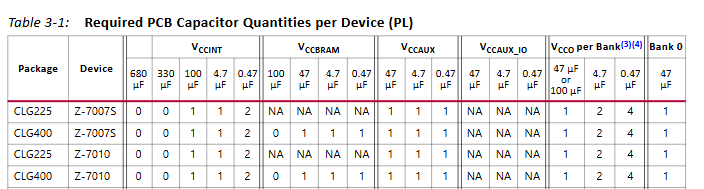
- PS端：
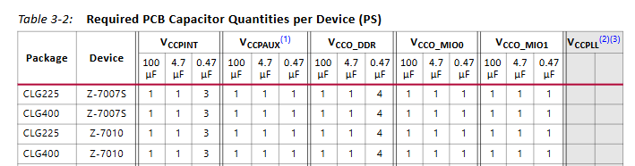

- 电容规格要求：
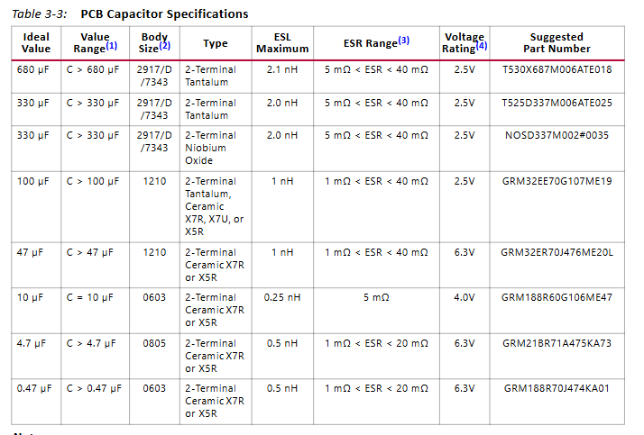

- 电源中的去耦电容长度要求：
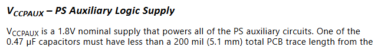

- 如果使用$V_{CCPAUX}$供电，需要一个$120 \Omega @ 100MHz ，0603$的磁珠和一个10uF,0603的电容。无论如何供电，都需要在$V_{CCPLL}$的BGA过孔附近加上一个0.47uF到4.7uF的0402封装的电容。

- $V_{CCO\_DDR}$供电要求，$PS\_ DDR\_ DQ$和$PS\_ DDR\_ DQS$需要连接到$\frac{V_{CCO\_ DDR}}{2}$，用电阻分压器生成参考电压$V_{REF}$需要0.01uF和0.47uF的电容进行去耦。：
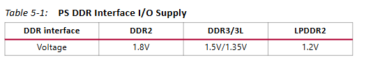 

- PS的I/O组电源配置：
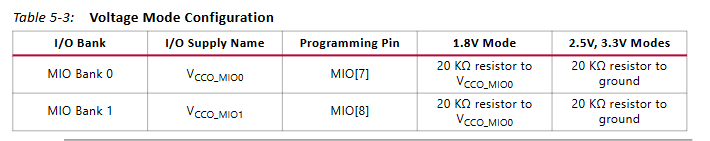

- 如果使用 RGMII ，需要把 $PS\_ MIO\_ VREF$连接到$V_{CCO\_ MIO1}$电压的一半，并添加一个0.01uF的电容进行去耦。

### 3.2 PS时钟和复位

-  PS_CLK 需要连接到 30-60MHz的时钟发生器，单端LVCMOS信号，且电平和VCCO_MIO0 I/O的电压相同。

- 上电过程中，PS_POR_B输入需要保持接地，直到VGS，VGS1和VGS2达到最低工作电平。

- 在VGS达到0.80V之前，断电阶段必须满足以下4个条件之一：PS_POR_B输入接地,PS_CLK输入的时钟被禁用，VGS低于0.70或VGS2低于0.90V。该条件必须保持到VGS达到0.40V为止。

- PS系统复位信号 PS_SRST_B是一个低电平有效，启动过程需要拉高，不用的时候拉到到$V_{CCO\_ MIO1}$。

### 3.3 启动模式引脚：

- MIO[8:2]配置启动模式等，需要串联一个20k的上拉或者下拉电阻。

- MIO[8]的上拉或者下拉电阻导线在10mm以下。

- 系统设置需要切换模式时，用跳线来选择。

- PL 系统的JTAG接口PL_JTAG 的信号TDI，TMS和TCK需要上拉。

### 3.4 动态内存：

- 供电电压：
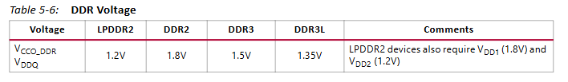
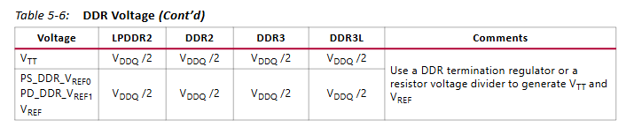

- 使用DDR2时，内存初始化期间需要把ODT,CKE信号通过一个4.7k的电阻拉到GND。

- 对于DDR3，内存初始化期间需要把 DRST_B信号进行4.7K的电阻下拉到GND。

- DDR的延迟匹配：
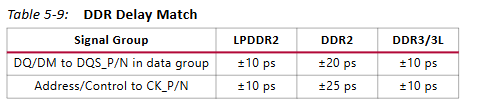

- DDR的走线阻抗：
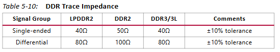

- 校准输出阻抗的电阻RZQ数值：
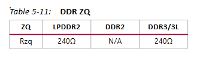

- DDR布线长度限制：
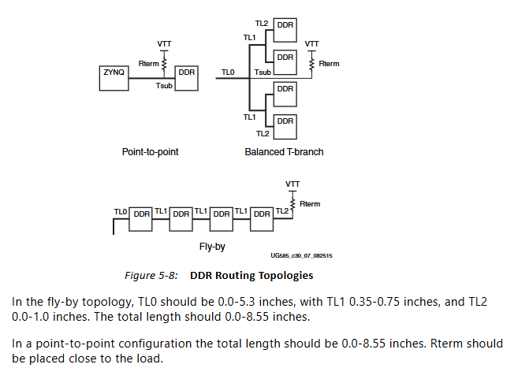

- 拓扑结构建议：
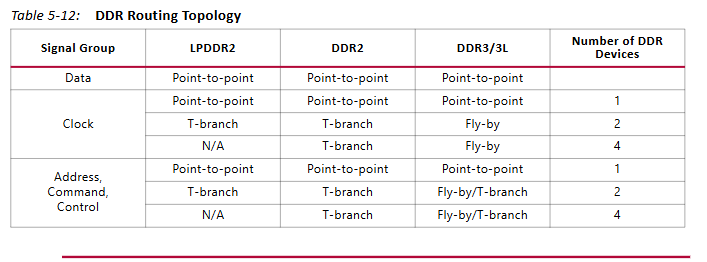

## 4. MIO/EMIO IP布局指南：

- 使用以太网的时候，要求TX/RX时钟相对于数据线和控制线进行延迟。支持RGMII v1.3的PHY：使用更长的PCB走线时，要求时钟延迟1.5ns至2.0ns.DATA[3:0]的CTL延迟偏差应该小于100ps。

- 支持无内部延迟的RGMII v2.0的PHY，使用更长的PCB走线时，需要时钟延迟1.5ns至2.0ns.DATA[3:0]的CTL延迟偏差应该小于100ps。

- 支持带内部延迟的RGMII v2.0的PHY，DATA[3:0]的CTL延迟应该小于+-50ps。

- IIC的SCL和SDA的远端应该连接一个4.7k的上拉电阻。

- SDIO 的 CLK 时钟线应该放置一个 40-60的串联电阻，尽可能靠近MIO信号脚。

- 如果没有使用温度传感二极管，需要把温度传感器接口的 DXP 和 DXN 接地。

- QSPI的时钟线和数据线，SS线要求等长。